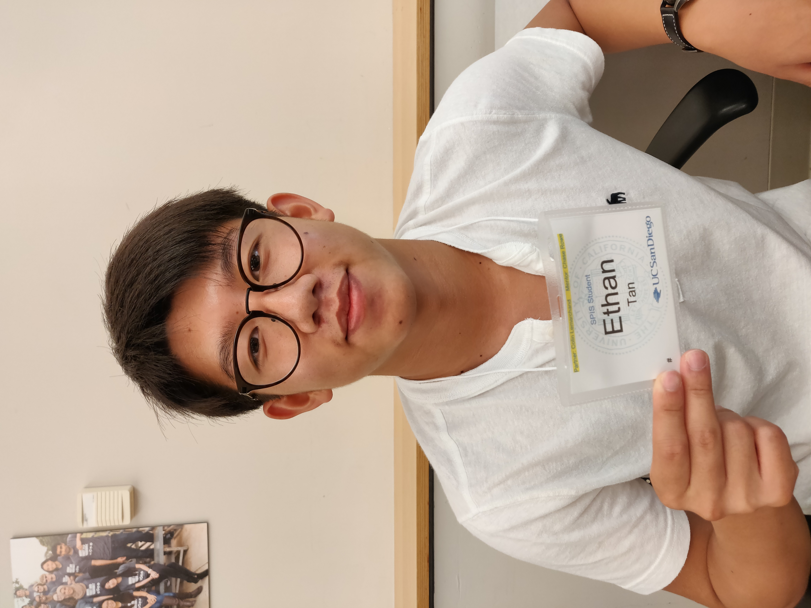

# practice-ethan-t
Hello. My name is Ethan as presented in the name of this README.md. I am from San Diego and some things I hope to learn during SPIS is the proper problem solving skills which will enable me to better transition into my computer science classes during the school year. I also hope to learn advanced computer science concepts which will make me a more competant programmer. I am interested in sports such as badminton, basketball (despite my small stature), and table tennis. I also like to play video games as well as board games with friends. 

